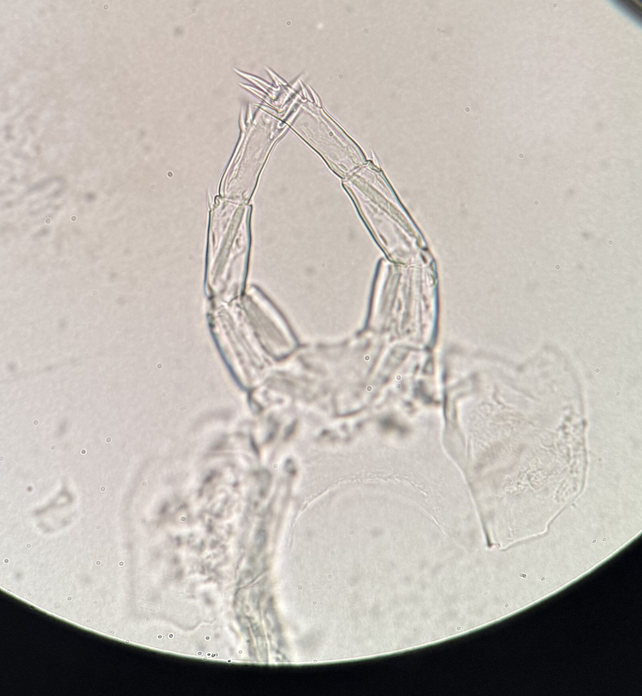

# *Epischura* species {#sec-compare-epischura}

```{r}
#| include: false
source(here::here("R", "common.R"))
```

```{r}
#| output: asis
compare_species(c("epischura_nordenskioldi", "epischura_massachusettsensis"))
```

## Key differences

| Character | `r species_ref("epischura_nordenskioldi")` | `r species_ref("epischura_massachusettsensis")` |
|---|---|---|
| Female urosome | Relatively straight, without torsion | *To confirm* (torsion is present in other *Epischura*) |
| Female P5, outer spines of terminal segment | Restricted to the distal half | Distributed along the entire segment |
| Male P5, process on inner surface of first segment | Long (much longer than segment width), slightly curved | Short and digitiform |

: Characters separating the two New England *Epischura* species. {#tbl-epischura}

<!-- Add side-by-side figures once E. massachusettsensis images are available:

::: {layout-ncol=2}



:::
-->
