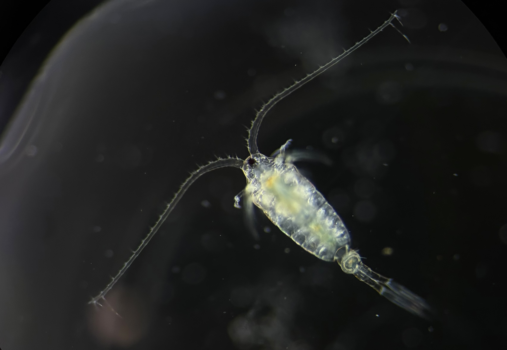

# *Epischura nordenskiöldi* {#sec-epischura-nordenskioldi}

```{r}
#| include: false
source(here::here("R", "common.R"))
sp <- species_info("epischura_nordenskioldi")
```

```{r}
#| output: asis
species_header(sp)
```

## Diagnosis

The female urosome is relatively straight, lacking the torsion seen in other
species of *Epischura* (@fig-epischura-nordenskioldi-female). The fifth legs
of both sexes separate it from *E. massachusettsensis*
(@fig-epischura-nordenskioldi-female-p5, @fig-epischura-nordenskioldi-male-p5;
see also @sec-compare-epischura).

## Morphology

{#fig-epischura-nordenskioldi-female}

{#fig-epischura-nordenskioldi-female-p5}

{#fig-epischura-nordenskioldi-male-p5}

## Records

```{r}
#| output: asis
species_records(sp)
```

```{r}
#| fig-cap: "Sites where this species has been collected (red) among all sampled sites (grey)."
#| fig-width: 4
#| fig-height: 4.5
#| out-width: "55%"
species_map(sp)
```

```{r}
#| fig-cap: "Collection records by month."
#| fig-width: 5
#| fig-height: 2.4
#| out-width: "70%"
species_season(sp)
```

## Notes

@schacht1898 notes variation in the number of spines on the terminal segment
of the female P5. The specimen in @fig-epischura-nordenskioldi-female-p5 has
six spines, but five are also observed.
